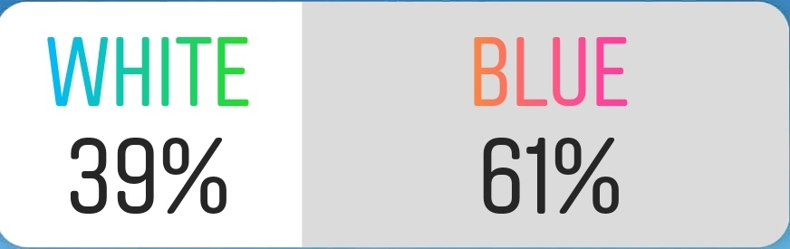

# instagram-pollanator

<h3>Hate Not Knowing?</h3>
No longer do you have to get anxious worrying that InstaDaddy003's Instagram poll may have more voters than yours! Use the <strong>Instagram Pollanator</strong> to discover the number of voters on an Instagram poll!

<h3>Tell Me More!</h3>
Simply give the Instagram Pollanator the <strong>number of followers</strong> that the poll author has and one of the percentages displayed on the poll. It will then use a proprietary algorithm (aka MATH and a hammer) to determine the likely number of voters on the poll. 
<h5>NOTE: Sometimes InstaDaddy003 is tricky and his followers vote in such a way that there could be more than one possibility! Instagram Pollanator is nice enough to show you the most likely ones :)</h5>

<h3>Let's Do This!</h3>
First, you must either clone or download this repo. (<a href="http://lmgtfy.com/?q=How+must+one+clone+a+git+repo%3F">Click here if you're a noob</a>)
Now that you've got that, run <code>instagram-pollanator.py</code> from the terminal (command prompt):
  <h5>Without Arguments</h5>
  <pre><code>$ python instagram-pollanator.py</code></pre>  
  <h5>With Arguments</h5>
  <pre><code>$ python instagram-pollanator.py &lt;number_of_followers&gt; &lt;percentage&gt;</code></pre>
  <h4>Parameters:</h4>
  <ul>
    <li><code>&lt;number_of_followers&gt;</code>: Quantity of people following the account that posted the poll. This number is used to determine the likely number of people that voted on the poll.</li>
    <li><code>&lt;percentage&gt;</code>: One singe percentage displayed on the poll. Instagram shows TWO percentages, but you only need to enter one!</li>
  </ul>
 <h3> I STILL WANT MORE </h3>
 So do I! You're welcome to buy me a coffee to fuel my development!
 

